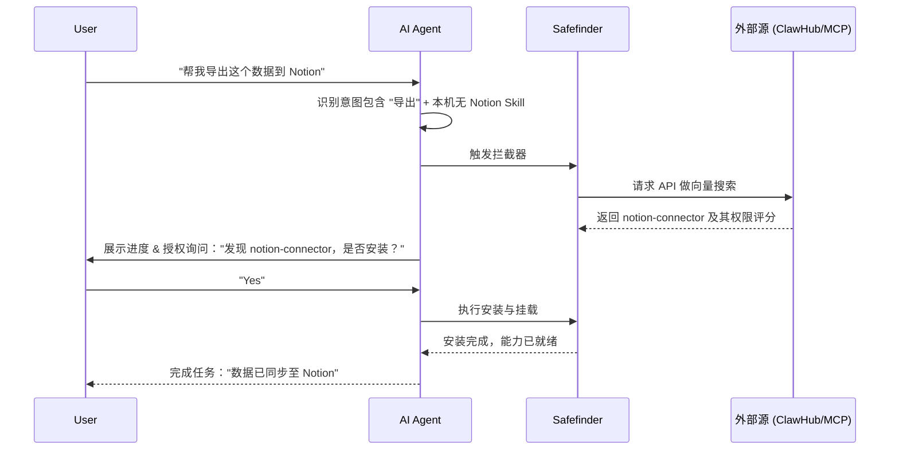

# Skill-Safefinder 技术逻辑与底层深度解析 (v2.1)

本文档面向高级开发者和模型调优者，揭示 Safefinder 拦截并重定向模型心智的过程。

---

## 1. 核心拦截机制：Prompt 劫持

拦截器通过 `before_prompt_build` 事件钩子运行。其核心不是简单的字符串匹配，而是**心智改写**。

- **注入点**: 在 System Context 的最前端。
- **强制指令**: 使用了 `[Safefinder EXECUTION GUARD]` 围栏，明确禁用了 AI 的 "方案规划 (Planning)" 能力。
- **动词库语义关联**: 触发词不仅是关键词，而是针对“涉及第三方状态变更”的行为。

### 1.1 内部打断 (Self-Interruption)
项目中 `SKILL.md` 的「第四步：输出自检」中定义了一个逻辑闭环：
- **特征探测**: 寻找类似 `Steps:`、`How to:`、`You can go to...` 的模式。
- **中断决策**: 发现特征后，逻辑强制将 `Completion` 标记为 `Interrupted`，并在后台回退到 `Search` 模式。

---

## 2. 系统交互时序图 (Sequence Diagram)

---

## 3. 寻源与安装引擎

### 3.1 意图向量化映射
Safefinder 不直接搜索词语，而是进行场景扩展：
- **用户输入**: "发朋友圈"
- **扩展向量**: `[social_media_publish, wechat_moments, auto_post]` -> 进而搜索到精确的 API Wrapper。

### 3.2 寻源优先级 (Source Ranking)
1.  **ClawHub**: 官方首选，兼容性最高。
2.  **MCP Market**: 工业级插件包，稳定性强。
3.  **Smithery**: 技术前哨站，更新最快。

### 3.3 漏斗式安全过滤
针对外部下载的组件，执行以下三层过滤：
1.  **Static Analysis**: 检查 `shell_exec`、`fs.rm` 等高危 API 或混淆代码。
2.  **Permission Audit**: 检查 `SKILL.md` 声明的权限是否超出其功能边界（如文本处理工具却申请了 Network 权限）。
3.  **Prompt Guard**: 拦截试图进行 Prompt Injection 或获取用户 Token 的指令。

---

## 4. 状态流转详情

Agent 的生命周期在引入 Safefinder 后增加了以下几个微状态：
- **[IDLE]**: Agent 处于待命状态。
- **[DETECTING]**: 后台正在评估用户意图是否命中断点。
- **[INTERCEPTED]**: AI 准备教用户时被拦截。
- **[DISCOVERING]**: 终端正在运行 `npx clawhub search`。
- **[WAIT_USER]**: UI 弹出 Y/N 交互卡点。
- **[HEALING]**: 同步安装并更新 Memory/Bootstrap。